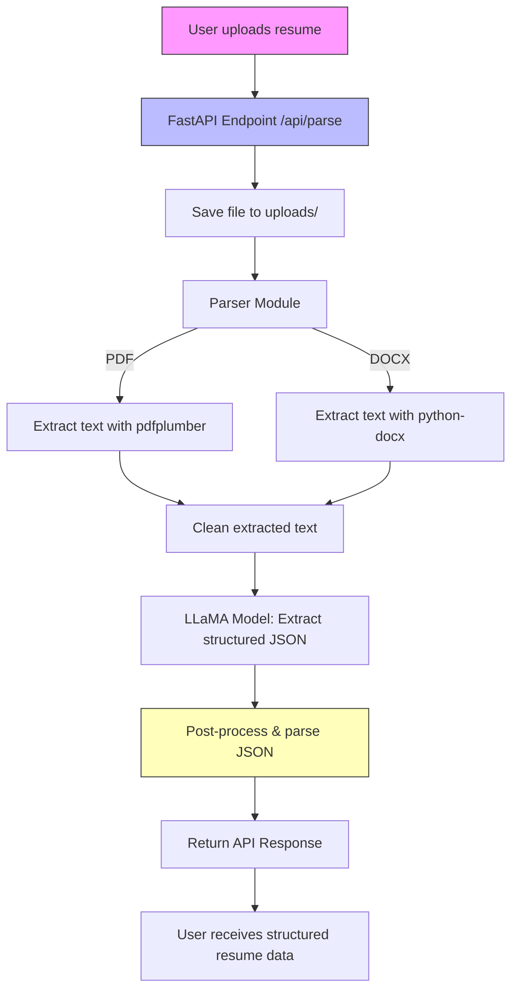

# 🧠 Resume Parser API

## 📄 Project Description
This project provides a simple API to parse resumes in **PDF** or **DOCX** format and extract structured information such as **contact details, work experience, skills, and education**.  
It uses a local **LLaMA model** for text understanding and **FastAPI** for serving the API.

---

## 📁 Project Structure



### Directory Layout

```
resume-parser/
│
├─ app/
│  ├─ main.py           # FastAPI entrypoint
│  ├─ parser.py         # Resume parsing logic
│  └─ utils.py          # Helper functions for PDF/DOCX extraction & cleaning
│
├─ models/              # Folder to store LLaMA model
├─ uploads/             # Temporary upload folder
├─ Dockerfile
├─ requirements.txt
└─ README.md
```

---

## ⚙️ Tech Stack
- **Python 3.11+**
- **FastAPI** – Web framework for building the API
- **Uvicorn** – ASGI server
- **pdfplumber** – PDF text extraction
- **python-docx** – DOCX text extraction
- **llama-cpp-python** – Local LLaMA model inference
- **Docker** – Containerization for easy setup

---

## 🚀 Setup / Installation

Before running the container, you must **download the LLaMA model file** and place it into the `models/` folder.

### 🧩 Step 1: Download the Model
Download the model file from Hugging Face:

👉 [Llama-3.2-1B-Instruct-f16.gguf](https://huggingface.co/bartowski/Llama-3.2-1B-Instruct-GGUF/blob/main/Llama-3.2-1B-Instruct-f16.gguf)

Place the downloaded file inside your project directory:
```
resume-parser/models/Llama-3.2-1B-Instruct-f16.gguf
```

---

### 🐳 Option 1: Download the Prebuilt Container (Recommended)

1. Clone the repository:
   ```bash
   git clone https://github.com/yourusername/resume-parser.git
   cd resume-parser
   ```

2. Download the prebuilt Docker image:
   ```bash
   docker load -i resume-parser.tar
   ```

3. Run the container:
   ```bash
   docker run -d -p 8000:8000 resume-parser:latest
   ```

4. Open your browser and navigate to:
   ```
   http://localhost:8000/docs
   ```
   You can also run it on any port, but be sure to include `/docs` at the end to access the Swagger UI.

---

### 🔧 Option 2: Build the Container Yourself

1. Clone the repository:
   ```bash
   git clone https://github.com/yourusername/resume-parser.git
   cd resume-parser
   ```

2. Build the Docker image:
   ```bash
   docker build -t resume-parser:latest .
   ```

3. Run the container:
   ```bash
   docker run -d -p 8000:8000 resume-parser:latest
   ```

4. Access the API documentation:
   ```
   http://localhost:8000/docs
   ```

---

## 🧾 Example Output

Using a **Software Developer** resume as input, the JSON response might look like:

```json
{
  "success": true,
  "data": {
    "contact": {
      "name": "CYNTHIA DWAYNE",
      "email": "cynthia@beamjobs.com",
      "phone": "(123) 456-7890",
      "location": "New York, NY"
    },
    "experience": [
      {
        "company": "QuickBooks",
        "title": "Software Developer",
        "start_date": "January 2017",
        "end_date": "Current",
        "location": "Brooklyn, NY",
        "description": "Worked on the payments team; migrated to AWS and reduced cloud costs by $260,000 per year."
      },
      {
        "company": "Front-End Developer",
        "title": "Front-End Developer",
        "start_date": "January 2014",
        "end_date": "December 2016",
        "location": "New York, NY",
        "description": "Contributed to UI library; created reusable components; improved customer conversion rate by 17%."
      }
    ],
    "skills": ["Python", "JavaScript", "Cloud (GCP, AWS)", "SQL (PostgreSQL, MySQL)", "TypeScript"],
    "education": [
      {
        "institution": "University of Delaware",
        "degree": "Bachelor of Science in Computer Science",
        "start_date": "August 2008",
        "end_date": "May 2012",
        "location": "Newark, DE"
      }
    ]
  }
}
```

This output contains:
- **Contact details**: name, email, phone, location  
- **Experience**: company, title, dates, description, and location  
- **Skills**: extracted technical and soft skills  
- **Education**: institution, degree, and dates

---

## 🧠 Design Decisions & Considerations

### Libraries & Approach
- **FastAPI**: Easy setup, auto-generated documentation, async-friendly.
- **pdfplumber & python-docx**: Lightweight text extraction without external dependencies.
- **llama-cpp-python**: Enables fully local inference for data privacy and offline use.

### Accuracy vs. Performance
- Regex extraction is fast but may miss edge cases.
- LLaMA-based extraction provides context-aware understanding but can produce incomplete JSON.
- Large resumes are **chunked** to fit within the model’s context window, and results are merged post-processing.

### Future Improvements
- Enhance entity extraction via NLP or fine-tuned LLaMA.
- Smarter chunk merging and schema validation with `pydantic`.
- Optional GPU acceleration for faster inference.
- Cloud integration for scalable parsing (Celery, Redis, database persistence).

---

## ⚠️ Known Limitations
- Large resumes may exceed model context limits.
- Output JSON may require post-processing for strict schema compliance.
- CPU-only inference is slower; GPU is recommended for production.
- Model must be manually downloaded before first use.

---

## 🧩 License
MIT License © 2025 Your Name

---

## 💬 Contact
For questions or contributions, feel free to open an issue or pull request on GitHub.
