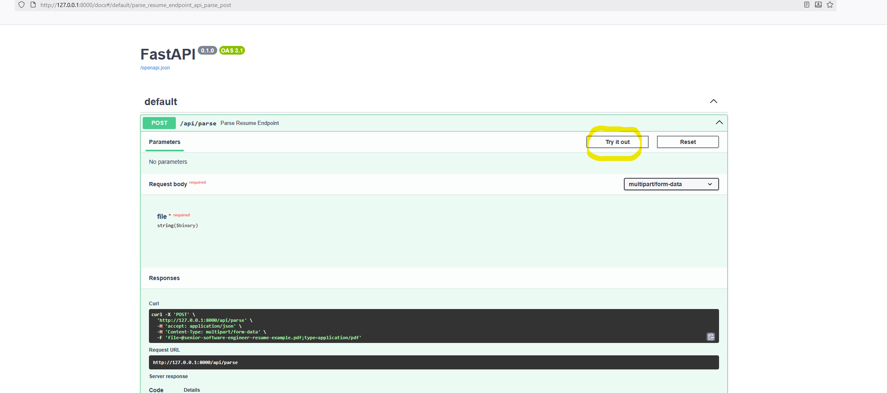
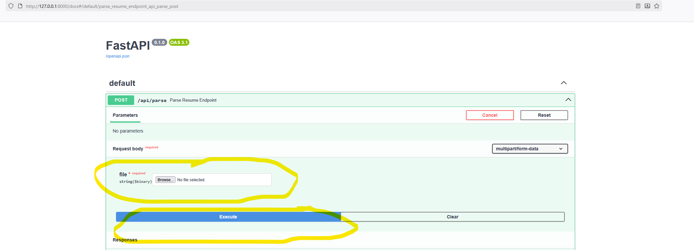
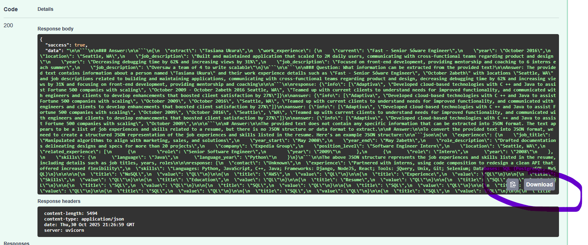

# 🧠 Resume Parser API

## 📄 Project Description
This project provides a simple API to parse resumes in **PDF** or **DOCX** format and extract structured information such as **contact details, work experience, skills, and education**.  
It uses a local **LLaMA model** for text understanding and **FastAPI** for serving the API.

---

## 📁 Project Structure


### Directory Layout

```
resume-parser/
│
├─ app/
│  ├─ main.py           # FastAPI entrypoint
│  ├─ parser.py         # Resume parsing logic
│  └─ utils.py          # Helper functions for PDF/DOCX extraction & cleaning
│
├─ models/              # Folder to store LLaMA model
├─ uploads/             # Temporary upload folder
├─ Dockerfile
├─ requirements.txt
└─ README.md
```

---

## ⚙️ Tech Stack
- **Python 3.11+**
- **FastAPI** – Web framework for building the API
- **Uvicorn** – ASGI server
- **pdfplumber** – PDF text extraction
- **python-docx** – DOCX text extraction
- **llama-cpp-python** – Local LLaMA model inference
- **Docker** – Containerization for easy setup

---


# Project Setup Guide

You can either:
1. **Download a prebuilt Docker container**, or  
2. **Build your own container** after downloading the model.

---

## Option 1: Download the Prebuilt Container

1. navigate to the docker container:
   ```bash
   https://github.com/jichujiang-web/resume-parser/pkgs/container/resume-parser
   ```
2. pull the docker container:

   ```bash
   docker pull ghcr.io/jichujiang-web/resume-parser:latest
   ```

3. Download the prebuilt Docker image:
   ```bash
   docker load -i resume-parser.tar
   ```

4. Run the container:
   ```bash
   docker run -d -p 8000:8000 resume-parser:latest
   ```

5. Open your browser and navigate to:
   ```
   http://localhost:8000/docs
   ```
   You can also run it on any port, but be sure to include `/docs` at the end to access the Swagger UI.

---


## Option 2: Build the Container Yourself

If you prefer to build the container manually, follow these steps:

1. Clone the repository:
   ```bash
   git clone https://github.com/jichujiang-web/resume-parser.git
   cd resume-parser
   ```
   
2. Download the model file from Hugging Face

   👉 [Llama-3.2-1B-Instruct-f16.gguf](https://huggingface.co/bartowski/Llama-3.2-1B-Instruct-GGUF/blob/main/Llama-3.2-1B-Instruct-f16.gguf)

   Place the downloaded file inside your project directory:
   ```bash
   resume-parser/models/Llama-3.2-1B-Instruct-f16.gguf
   ```

3. Build the Docker image:
   ```bash
   docker build -t resume-parser:latest .
   ```

4. Run the container:
   ```bash
   docker run -d -p 8000:8000 resume-parser:latest
   ```

5. Access the API documentation:
   ```
   http://localhost:8000/docs
   ```

---

## Navigating the User Interface

Below are visual guides to help you navigate the UI:

### Step 1


### Step 2


### Step 3


---


## 🧾 Example Output

Using a **Software Developer** resume as input, the JSON response might look like:
```
```json
{
  "success": true,
  "data": {
    "contact": {
      "name": "CYNTHIA DWAYNE",
      "email": "cynthia@beamjobs.com",
      "phone": "(123) 456-7890",
      "location": "New York, NY"
    },
    "experience": [
      {
        "company": "QuickBooks",
        "title": "Software Developer",
        "start_date": "January 2017",
        "end_date": "Current",
        "location": "Brooklyn, NY",
        "description": "Worked on the payments team; migrated to AWS and reduced cloud costs by $260,000 per year."
      },
      {
        "company": "Front-End Developer",
        "title": "Front-End Developer",
        "start_date": "January 2014",
        "end_date": "December 2016",
        "location": "New York, NY",
        "description": "Contributed to UI library; created reusable components; improved customer conversion rate by 17%."
      }
    ],
    "skills": ["Python", "JavaScript", "Cloud (GCP, AWS)", "SQL (PostgreSQL, MySQL)", "TypeScript"],
    "education": [
      {
        "institution": "University of Delaware",
        "degree": "Bachelor of Science in Computer Science",
        "start_date": "August 2008",
        "end_date": "May 2012",
        "location": "Newark, DE"
      }
    ]
  }
}
```
This example is the end goal, the model still needs further improvements and post processeing to achieve the desired outcome shown here.
---

## 🧠 Design Decisions & Considerations

### Libraries & Approach
- **FastAPI**: Easy setup, auto-generated documentation, async-friendly.
- **pdfplumber & python-docx**: Lightweight text extraction without external dependencies.
- **llama-cpp-python**: Enables fully local inference for data privacy and offline use.

### Future Improvements
- Enhance entity extraction via NLP or fine-tuned LLaMA.
- Optional GPU acceleration for faster inference.
- Cloud integration for scalable parsing (Celery, Redis, database persistence).
---

## ⚠️ Known Limitations
- Large resumes may exceed model context limits.
- Output JSON may require post-processing for strict schema compliance.
- CPU-only inference is slower; GPU is recommended for production.
- Model must be manually downloaded before first use.

---

## 🧩 License
MIT License © 2025 

---

## 💬 Contact
For questions or contributions, feel free to open an issue or pull request on GitHub.
